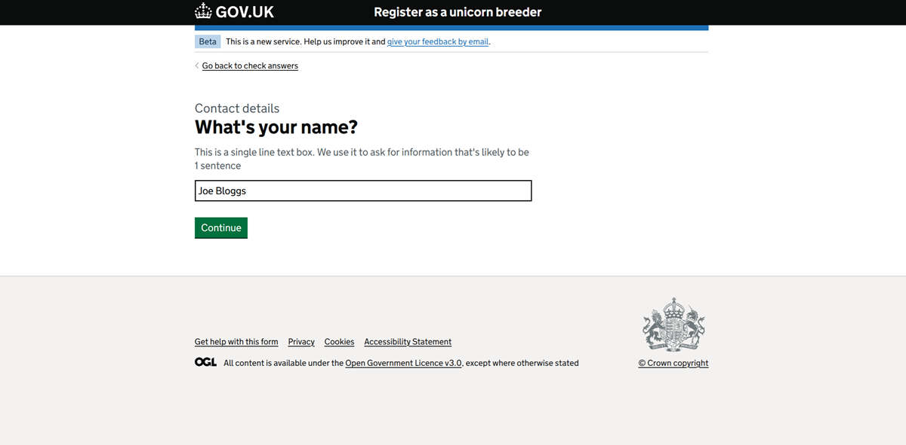

**@defra/forms-engine-plugin** simplifies form development with a configuration-driven approach. Create GOV.UK-compliant journeys effortlessly — no code required. For advanced needs, extend functionality with minimal code. Build custom components, tailored pages, and integrate seamlessly with APIs, all while adhering to the GDS Design System.

## Installation

[See our getting started developer guide](/docs/GETTING_STARTED.md).

## Demo

If you are within the Defra network, [see a live demo](https://forms-engine-plugin-example-ui.dev.cdp-int.defra.cloud/example-form).

If you aren't within the Defra network, [see our example UI and run it locally](https://github.com/DEFRA/forms-engine-plugin-example-ui).
