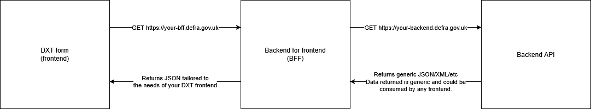

# Page events

Page events are a configuration-based way of triggering an action on an event trigger. For example, when a page loads, call an API and retrieve the data from it.

DXT's forms engine is a frontend service, which should remain as lightweight as possible with business logic being implemented in a backend/BFF API. Using page events, DXT can call your API and use the tailored response downstream, such a page templates to display the response value.

The downstream API response becomes available under the `{{ context.data }}` view model attribute for view templates, so it can be used when rendering a page. This attribute is directly accessible by our [page templates](/forms-engine-plugin/features/configuration-based/PAGE_TEMPLATES) feature and our Nunjucks-based views.

## Architecture

DXT will call any API of your choosing, so ultimately the architecture is up to you. As long as that API accepts the DXT payload, returns HTTP 200 and returns a valid JSON document as the response body, you will be able to use page events.

Our recommendation is that you create a lightweight backend service called a "BFF" (backend for frontend). This is a common pattern that allows you to decouple your backend service from the frontend implementation, allowing you to tailor your existing backend API to a different frontend. To learn more about this pattern, see [Microsoft's guide](https://learn.microsoft.com/en-us/azure/architecture/patterns/backends-for-frontends).



If DXT is the only consumer of your API, it may make sense to omit the BFF and have DXT directly call your backend.

## Setting up a page event

A page event is configured by defining the event trigger, then the action configuration. For example, to call an API on page load:

```json
{
  "onLoad": {
    "type": "http",
    "options": {
      "url": "https://my-api.defra.gov.uk"
    }
  }
}
```

See [supported events](#supported-events) to learn more about the supported triggers and actions.

## Supported events

### Supported triggers

Currently supported event types:

- `onLoad`: Called on load of a page (e.g. the initial GET request to load the page)
- `onSave`: Called on save of a page, after the data has been validated by DXT and the _page controller_ returns a 2xx or 3xx response. Note: if there's any data validation issues requiring a redirect/error, these are handled by the engine before a page controller's involvement and as a result the page event will only trigger when the engine is satisfied and the page controller is.

### Supported actions

- `http`: Makes a HTTP(S) call to a web service. This service must be routable on DXT (e.g. by configuring CDP's squid proxy), must accept DXT's standardised payload, return HTTP 200 and a valid JSON document.
  - Options:
    - `method`: The HTTP method, e.g. `POST` or `GET`. Note that forms-engine-plugin posts the form state as a payload, so `POST` is the correct method if you need to parse the form data.
    - `url`: A fully formed HTTP(S) URL, e.g. `https://my-api.defra.gov.uk` or `https://my-api.prod.cdp-int.defra.cloud`

## Payload

DXT sends a standardised payload to each API configured with page events. The latest version of our payload [can be found in our outputFormatters module by opening the latest version, e.g. `v2.ts`](https://github.com/DEFRA/forms-engine-plugin/tree/main/src/server/plugins/engine/outputFormatters/machine). Our payload contains some metadata about the payload, along with a "data" section that contains the main body of the form as a JSON object, an array of repeatable pages, and a file ID and download link for all files submitted.

As of 2025-03-25, the payload would look something like this:

```jsonc
{
  "meta": {
    "schemaVersion": "2",
    "timestamp": "2025-03-25T10:00:00Z",
    "definition": {
      // This object would be a full copy of the form definition at the time of submission. It is excluded for brevity.
    }
  },
  "data": {
    "main": {
      "componentName": "componentValue",
      "richComponentName": { "foo": "bar", "baz": true }
    },
    "repeaters": {
      "repeaterName": [
        {
          "textComponentName": "componentValue"
        },
        {
          "richComponentName": { "foo": "bar", "baz": true }
        }
      ]
    },
    "files": {
      "fileComponentName": [
        {
          "fileId": "123-456-789",
          "link": "https://forms-designer/file-download/123-456-789"
        }
      ]
    }
  }
}
```

## Using the response from your API in DXT

If the API call is successful, the JSON response your API returns will be attached to the page `context` under the `data` attribute. Liquid/Nunjucks can then use this data however it would normally use variables, for example:

Your API response:

```json
{
  "awardedGrantValue": "150"
}
```

Page template:

```jinja2

  <p class="govuk-body">Congratulations. You are likely to receive up to £{{ context.data.awardedGrantValue }}.</p>

  <p class="govuk-body">You have not been awarded any funding for this application.</p>

```

Results in:

```text
<p class="govuk-body">You have been awarded £150.</p>
```

## Authenticating a HTTP page event request from DXT in your API

The `preparePageEventRequestOptions` plugin option allows you to prepare the request options during a page event http request. This is useful to apply auth headers to the request.

```js
await server.register({
  plugin,
  options: {
    preparePageEventRequestOptions:  (options: RequestOptions, event: Event, page: PageControllerClass, context: FormContext) => {
      // Request `options` are passed with the expectation they'll be manipulated
      // The current `event`, `page` and `context` are passed for reference
      options.headers = {
        authorization: 'my token'
      }
    }
  }
})
```
